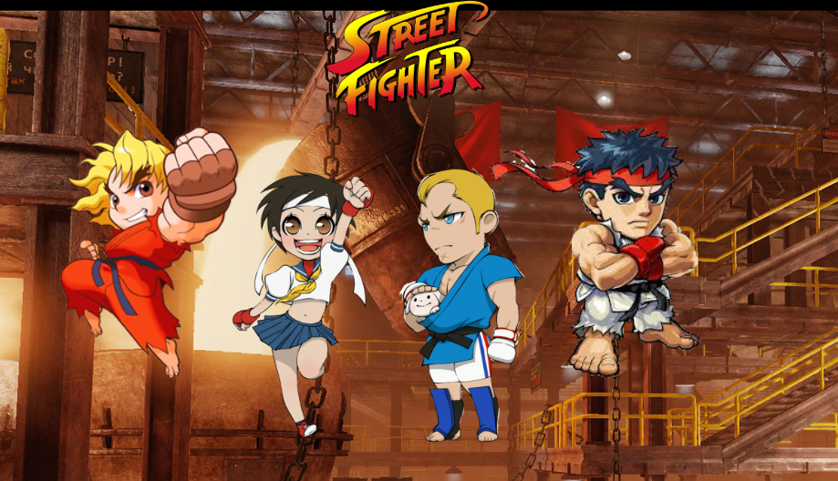

# RPG-street-fighter-game

### Overview

I have created a HTML/CSS Word Guess Browser Game that uses JavaScript to compose the logic and jQuery for DOM manipulation.

### Before You Begin

* Please note that once you defeat the first opponent, it does not allow you to fight the remaining two opponents, this will be updated! (Stay tune! :boom: )

### Object Of The Game

The object of the game is to defeat all of your opponents before your health points reach `zero`. At the start of the game you will choose your player out of four available options, the other three characters will then become your opponent! Each time you attack your opponent your `XP` points will double giving you more strength to help defeat your opponents.

### Game Instructions

1. Select a player out of the lists of characters:  `Ken`, `Ryu`, `Sakura`, or `Chibi`.
2. Your selected player will then move to the `Attack` section.
3. Your opponents will move to the `Defend` section.
4. Click the `Attack!` button to log attack damange to your opponent.
5. Once you attack your opponent, your opponent will strike back with a `Counter Attack`!
6. Each time your attack your opponent your `XP` points double.
7. Diminish all your opponets health points before yours reach `zero` to `WIN`! 
8. Choose your `player` wisely as this is the key to the game!

### Snapshot of Game

##### Link to GitHub Respo

https://github.com/kalieshapickering/RPG-street-fighter-game

#### URL Link

https://kalieshapickering.github.io/RPG-street-fighter-game/